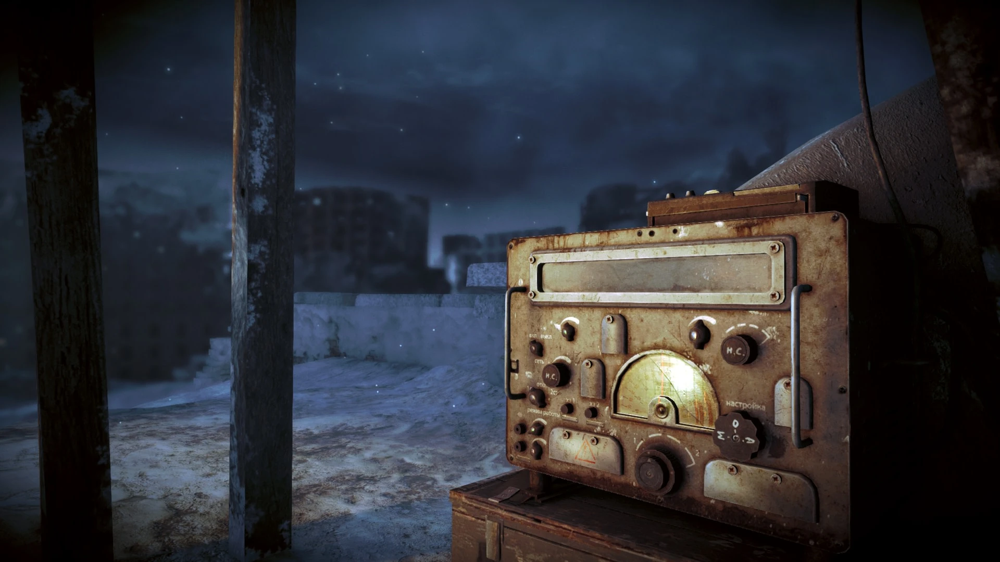

 <div style="text-align: right">
Metro 2033 (Video Game)<br/>
© 4A Games
</div>

# 信号
由于时间限制，本章节删去了 Bezier 和 NURBS 用于重建连续曲线的内容。这些内容会在后来的讲义中补上，讲座不会介绍。

信号是一个偏电气电子的名词，将其用在图形学领域看起来有点奇怪。但是别忘了我在讲座介绍里所写的，图形学是计算机科学中最“不”计算机的分支：在此前的“几何”部分中，在刚体动力学和射影几何的轮番攻击下，相信大家也逐渐形成了这样的认识。

《信号与系统》课程努力向电气电子的学生传递的一个信息就是：需要以“信号”和“系统”的角度来看待世界。现在，让我们也试试从“信号”的角度来看待计算机图形学，至于系统……留给大家自己思考吧。

首先，由于本讲座面向的同学未必已经修过了《信号与系统》课程，我先带领大家速通一下。

## 主要内容
* 傅里叶分析
	* 引子：时间之外的故事
	* 连续时间傅里叶变换（Continuous Time Fourier Transform, CTFT）
	* δ函数（连续时间冲激信号）
	* 线性时不变系统（Linear Time Invariant System, LTI System）
	* 图像信号与图像滤波
* 抗锯齿（Anti-aliasing, AA）技术
	* 理想采样序列
	* 奈奎斯特-香农采样定理（Nyquist–Shannon Sampling Theorem）
	* 超级采样抗锯齿（Supersample Anti-aliasing, SSAA）和多重采样抗锯齿（Multisample Anti-aliasing, MSAA）
	* 抗锯齿技术的发展

## 傅里叶分析
### 引子：时间之外的故事
人类习惯于从时间的角度看待事物。在历史上有相当漫长的时间，人类的科学也都被困在时间里。对时间的惯用确实带来了不少问题，比如一些物理现象需要高阶的线性微分方程（Linear Difference Equation, LDE）来描述，要求解这些 LDE 就需要用到不少技巧。傅里叶分析的出现，使人类能从一个全新的视角看待物理问题，在图形学中也是如此。

受限于篇幅，我们将只讨论连续时间傅里叶分析及其在图形领域的若干应用。我们知道计算机是离散的系统，但是无妨，从连续的角度思考依然能得到正确的结论。

### 连续时间傅里叶变换（Continuous Time Fourier Transform, CTFT）
对于时域上的函数 $f(t)\in L^2(-\infty,+\infty)$ 可以使用积分变换核（kernel） $e^{-j\omega t}$ 变换为频域上的函数 $F(\omega)$：
$$
F(\omega) = \int_{-\infty}^{+\infty}f(t)e^{-j\omega t}dt
$$
同时，有傅里叶逆变换
$$
f(t)=\frac{1}{2\pi}\int_{-\infty}^{+\infty}F(\omega)e^{+j\omega t}d\omega
$$
$F(\omega)$ 和 $f(t)$ 是**同一个物理过程在不同域的不同看法**，就像一面奇怪的**镜子**，有注记
$$
F(\omega) \leftrightarrow f(t)
$$
>一个物理过程在时域和频域测得的能量应该是一致的：
>$$
\int_{-\infty}^{+\infty}|x(t)|^2dt=\frac{1}{2\pi}\int_{-\infty}^{+\infty}|X(\omega)|^2d\omega
>$$
>这被称为 Parseval 恒等式。

傅里叶变换是线性变换，如果我们将FT记为 $\mathcal{F}[\cdot]$，那么
$$
\mathcal{F}[af(t)+bg(t)]=a\mathcal{F}[f(t)]+b\mathcal{F}[g(t)]
$$
还记得我们之前介绍的在时域中求解 LDE 的问题吗？在频域中，求导算子变得异常简单
$$
\frac{d}{dt}f(t) \leftrightarrow (j\omega)F(\omega)
$$
由此，线性微分方程在我们的视角下变成了一个一般的线性方程。

傅里叶变换还能简化时域的卷积运算：
$$
f(t)*g(t) \leftrightarrow F(\omega)G(\omega)
$$
当然别忘了傅里叶变换是一面镜子，所以它也能简化频域的卷积运算：
$$
F(\omega)*G(\omega) \leftrightarrow 2\pi f(t)g(t)
$$

至于什么是卷积，我们稍后会介绍。

### δ函数（连续时间冲激信号）

为了快速介绍什么是$\delta$函数，我给一个非常不优雅的“定义”：
$$
\delta(t) = 
\begin{cases}
+\infty, x=0\\
0, x\neq0
\end{cases}
且
\int_{-\infty}^{+\infty}\delta(t)dt=1
$$
在很多的工程和物理学课本中，都能看到这样的“定义”。

$\delta$ 函数有若干性质：
* 是偶函数；
* **筛选（sifting）** 特性：
$$
f(t)=\int_{-\infty}^{+\infty}f(\tau)\delta(\tau-t)d\tau
$$

>**筛选特性的启发式证明**
>
>由于$\delta(\tau-t)$在$\tau\neq t$的区域都为 $0$，所以只有 $f(t)$ 对被积函数有贡献。
>$$
f(t)=\int_{-\infty}^{+\infty}f(\tau)\delta(\tau-t)d\tau=\int_{-\infty}^{+\infty}f(t)\delta(\tau-t)d\tau\\
= f(t)\int_{-\infty}^{+\infty}\delta(\tau-t)d\tau = f(t)
>$$

上面我们介绍的是一维的δ函数，在三维空间中，我们类比体积微元可以给出三维的δ函数定义：
$$
\delta(x, y, z) = \delta(x)\delta(y)\delta(z)
$$
δ函数常用于表示一个脉冲或者点源，例如三维空间中的**理想点光源**，一些图形文献就将其称为**δ光源**。

先进行一个启发：大量的理想点光源排列在一起，可以组成现实中存在的面光源，这其实就是某种**卷积**！或者说点光源就成了给定边界条件下的**格林函数**！我们稍后分解。

### 线性时不变系统（Linear Time Invariant System, LTI System）
线性时不变系统具备线性和时不变性（这是一句废话）。由于篇幅所限，我们只考虑单输入单输出（Single Input Single Output, SISO）系统。一个单输入单输出系统是指输入一个信号 $x(t)$，输出一个信号 $y(t)$ 的系统。如果我们将这个系统记为 $S$，那么可以使用以下注记：
$$
S[x(t)]=y(t)
$$
但是这样似乎不太好反映“输入”和“输出”，所以也可以使用以下注记：
$$
S: x(t)\rightarrow y(t)
$$
LTI系统具有**线性**，即：
$$
x_1(t)\rightarrow y_1(t)\\
x_2(t)\rightarrow y_2(t)\\
ax_1(t)+bx_2(t)\rightarrow ay_1(t)+by_2(t)
$$
从物理的角度来理解，外界对 LTI 系统的输入不会互相干扰，LTI 系统独立地对各个输入做出响应。其实许多物理系统都满足这个性质，所谓叠加原理。

LTI系统具有**时不变性**，即：
$$
x(t)\rightarrow y(t)\\
x(t-t_0)\rightarrow y(t-t_0)
$$
相对线性性质，时不变性质可能会更难理解。举个简单的例子：开关按下（输入信号）灯打开（输出信号）。对于一个理想的灯，在每一次开关按下以后，灯点亮的过程应该都是一致的：昨天你按下开关打开灯和今天你按下开关打开灯并没有区别。这就是时不变性。

现在，我们已经知道了什么是线性时不变系统。那我们不妨就来考虑一个线性时不变系统 $T$，这个系统接受输入 $x(t)$，输出 $y(t)$，也就是
$$
T: x(t)\rightarrow y(t)
$$

现在，我们对 $x(t)$ 应用δ函数的筛选特性：
$$
x(t)=\int_{-\infty}^{+\infty}x(\tau)\delta(\tau-t)d\tau
$$
δ函数是偶函数
$$
x(t)=\int_{-\infty}^{+\infty}x(\tau)\delta(t-\tau)d\tau
$$
根据线性性质，有
$$
y(t) = T[x(t)]=\int_{-\infty}^{+\infty}x(\tau)T\bigg[\delta(t-\tau)\bigg]d\tau
$$
根据时不变性质，有
$$
y(t) = T[x(t)]=\int_{-\infty}^{+\infty}x(\tau)\bigg(T\bigg[\delta(t)\bigg](t-\tau)\bigg)d\tau
$$
上面这个表示非常的别扭，我们不妨设 LTI 系统 $T$ 对 $\delta(t)$ 的响应是 $h(t)$，从而可以简化表示上式：
$$
y(t) = T[x(t)]=\int_{-\infty}^{+\infty}x(\tau)\cdot h(t-\tau)d\tau
$$
非常巧合（对于非电子系的学生，往往只有卷积的知识而没有 LTI 的知识，所以就成了巧合/笑）的一件事就是，这个积分式是**卷积**：
$$
y(t) = T[x(t)]=\int_{-\infty}^{+\infty}x(\tau)\cdot h(t-\tau)d\tau = x(t)*h(t)
$$

总结一下上面的推导，我们发现：
* δ函数的筛选特性可以看作是对连续时间信号的**某种“分解”**，也就是在时间上分解成无数个平移后的冲激信号。
* 如果已知线性时不变系统的**冲激响应（impulse response）**$h(t)$，就相当于**从外部**（现代控制理论还会考虑系统内部的情形）唯一确定了这个线性时不变系统。
* 线性时不变系统实际上是**在时域上进行卷积操作**。**卷积等价于线性时不变系统。** 卷积其实就是将输入信号分解为一系列冲激信号以后，对各个冲激信号产生独立的响应，最后叠加。

我们已经基本完成了时域角度对 LTI 系统的讨论，现在我们换一个视角：
$$
y(t) = x(t)*h(t) \leftrightarrow Y(\omega) = X(\omega)H(\omega)
$$
我们发现：
* 可以通过 $H(\omega)$ 对 $X(\omega)$ 进行调相。
* 如果 $H(\omega)$ 在某一点或某一区域为 $0$，那么不管输入的 $X(\omega)$ 在这一点或这一区域取何值， $Y(\omega)$ 在这一点或这一区域都为 $0$。
    * 进一步的，系统只能通过 $H(\omega)$ 消除 $X(\omega)$ 的频率分量，但无法创造出新的频率分量。

实际上，我们发现 LTI 系统是一个**滤波器（filter）**。

到目前为止，我们在短时间内速成了《信号与系统》的连续时间分析将近一半的内容。形成了如下的重要认识：
$$
线性时不变系统 \Leftrightarrow 卷积 \Leftrightarrow 滤波器
$$

最后提一嘴，从线性时不变系统的角度来看，**卷积核（convolution kernel）** 其实就是冲激响应 $h(t)$。在通信领域，它也被称为滤波核（filter kernel）。作为一个交叉学科混沌邪恶的图形开发者，在下面的文章中这些名称我就混着用了。

### 图像信号与图像滤波
图像当然是一个信号。在本讲义中，我们认为图像是一个**二维“时间”信号**；当然如果你特立独行地认为图像是一个二维频率信号也无妨，毕竟傅里叶变换具备**对偶性（duality）**，是一面特殊的“镜子”。由数码相机拍摄得到的图像是**离散时间信号**，它其实是通过感光阵列对照射到感光阵列上的连续时间信号的一个采样，我们在下一节会详细讨论采样相关的问题。而在现代计算机中存储的大部分图像都是离散时间信号，就算是矢量图，也要经过**光栅化（rasterize）** 过程呈现在离散的屏幕上。

不过在本章开始已经提到，由于篇幅所限，我们将只介绍连续时间信号的相关理论，因为在多数情况下这些理论在离散空间下也能得到正确的结论，所以从现在开始，你可以认为我们讨论的“图像”信号是一个连续的信号。

现在我要提出一个非常简单的问题：大部分同学应该都使用过各种各样的图像处理软件，对图像进行模糊是一个相当基本的操作。那么图像模糊背后的原理是什么呢？

> 请注意，下面这一段可能是**这个世界上对图像模糊滤波最优雅的解释之一**。这是我某一天在听涛园吃面时产生的奇怪想法，如果你在别的地方也看到了类似的解释请务必告诉我，否则请你一旦有机会就狠狠的把这种解释发扬光大（别忘了备注是我说的/笑）。

首先我们需要知道模糊到底意味着什么。在“几何”部分中，我们曾经介绍过小孔摄像机的基本原理。当摄像机光圈无穷小时，外部两个不相同的点源（现在我们可以使用δ函数来理解点源了）在传感器阵列上产生的信号也应该是无穷小的光点（不考虑物理限制）；而当摄像机光圈较大时，外部两个不相同的点源在传感器阵列上会产生两个光斑，这两个光斑一旦距离过近，就会无法分辨，从而产生景深的模糊效果。我们能不能类比这种效果进行模糊操作？答案是肯定的。我们设计一个系统，使得它对于二维的冲激信号的冲激响应是一个“光斑”即可！

常见的卷积核有盒滤波器和高斯滤波器等。
* **盒滤波器（box filter）** 其实就是一个二维的**归一化**窗函数，在实际的时域计算中，表现为对一个区域的图像颜色值取平均值。
* **高斯滤波器（gaussian filter）** 其实就是在x和y两个分量上分别放了一个独立的**归一化**高斯因子：
$$
h(x, y) = \frac{1}{2\pi\sigma^2}e^{-\frac{x^2+y^2}{2\sigma^2}} = \frac{1}{2\pi\sigma^2}e^{\frac{-x^2}{2\sigma^2}}e^{\frac{-y^2}{2\sigma^2}}
$$

从频率的角度来理解，我们也能得到另一种看法。首先我们引入二维的傅里叶变换：
$$
F(u, v)=\int_{-\infty}^{+\infty}\int_{-\infty}^{+\infty}f(x, y)e^{-(jux+jvy)}dxdy
$$
考虑高斯滤波器，我们注意到高斯滤波器具备的良好性质是它自带变量分离，我们设高斯函数为 $g(\cdot)$：
$$
H(u, v)=\int_{-\infty}^{+\infty}g(x)e^{-jux}dx\int_{-\infty}^{+\infty}g(y)e^{-jvy}dy\\
=G(u)G(v)\\
=e^{-\frac{u^2\sigma^2}{2}}e^{-\frac{v^2\sigma^2}{2}}\\
=e^{-\frac{(u^2+v^2)\sigma^2}{2}}
$$
在 2D 下，卷积定理依然适用：
$$
p(x, y) * h(x, y) \leftrightarrow P(u, v)H(u, v)
$$
我们发现，高斯卷积核给图像的高频率分量乘了一个非常小的因子，极大的**削弱了高频分量**。

采用高斯卷积核/滤波核的图像模糊就是我们所知的**高斯模糊（Gaussian blur）**。

还有许多的滤波器可以从事不同的工作。例如 Sobel 卷积核可以用于查找图像变化剧烈的形状边缘区域，匹配滤波器可以用于查找图像中的图案等等。

我知道你可能在想什么，现在用于图像处理的人工神经网络是这个系统经过魔改以后的复杂版本。感兴趣的同学可以自行去寻找其中的联系。

## 抗锯齿（Anti-aliasing, AA）技术

### 理想采样序列
设想一个人工的信号**采样器（sampler）**：我写这篇讲义的日期是 2023/7/22，这时北京正在下阵雨，而我想粗略掌握今天的天气变化情况。我的策略是每隔三十分钟告别电脑屏幕，去阳台上休息休息眼睛顺便看看天气，然后记录下来。这其实就是我作为一个系统对天气这个连续的输入信号进行采样。

但是我毕竟是肉体凡胎，我的采样过程需要起身走到阳台，观察天气，然后记录下来，而且我不能精确地保证每隔三十分钟就出去看一次天气，毕竟这个讲义太难写了；而一个理想采样器应该在一个瞬间记录下此时输入信号的值。是不是有点熟悉？我们使用δ函数来描述理想采样序列：

$$
p(t)=\sum_{n=-\infty}^{+\infty}\delta(t-nT)
$$

大家需要逐渐养成看见时域信号就忍不住求它的傅里叶变换的习惯：

$$
P(\omega)=\frac{2\pi}{T}\sum_{n=-\infty}^{+\infty}\delta(\omega-n\omega_0)\\
其中\omega_0 = \frac{2\pi}{T}，称为采样角频率。
$$

> 不过这个傅里叶变换还真没那么好求，比较适合初学者的方法是先求 $p(t)$ 的傅里叶级数，然后对级数求傅里叶变换。

假设待采样的连续信号是 $x_a(t)$，采样得到的加权冲激串是 $x_s(t)$，那么采样过程其实就是：

$$
x_s(t)=x_a(t)\cdot p(t)
$$

在频域：

$$
X_s(\omega)=\frac{1}{2\pi} X_a(\omega) * P(\omega)
$$

还可以继续算，你先别急。放个小标题先。

### 奈奎斯特-香农采样定理（Nyquist–Shannon Sampling Theorem）

现在可以继续算了：

$$
X_s(\omega)=\frac{1}{2\pi} X_a(\omega) * P(\omega)\\
= \frac{1}{T} X_a(\omega) * \sum_{n=-\infty}^{+\infty}\delta(\omega-n\omega_0)\\
= \frac{1}{T} \sum_{n=-\infty}^{+\infty}X_a(\omega-n\omega_0)
$$

观察我们得到的最后一个式子，不难发现所谓的采样过程从频域的角度来看其实就是把原始信号的频谱 $X_a$ 沿着水平的 $\omega$ 轴周期性复制粘贴，从负无穷排列到正无穷，**然后加起来**。

现在，假设我们的原始信号 $x_a(t) \leftrightarrow X_a(\omega)$ 是一个**带宽受限（带限，Band limited，BL）** 信号，它的角频率（注意：FT产生的都是角频率，角频率和频率的关系是$\omega=2\pi f$）被限制在 $[-\omega_c, +\omega_c]$ 区间里，通过简单的作图（或者直接想象）我们可以得到如果采样频率$\omega_0>2\omega_c$，那么$X_a$在采样过程中沿着$\omega$轴从负无穷远到正无穷远的排列就不会彼此混叠起来，从而在相加以后，**频谱的形状**依然不会发生改变（尽管被克隆了无穷次）。而假如采样频率$\omega_0\leq2\omega_c$，$X_a$可能发生混叠，在相加以后得到的频谱的形状将会**丢失$X_a$的信息**。从而导致采样信号**失真**。

$2\omega_c$被称为**奈奎斯特频率（Nyquist frequency）**或者**奈奎斯特限制（Nyquist limit）**。

还记得此前天气的例子吗？我每隔一定时间对天气进行一次采样，假设北京在这一天的天气非常古怪，降水量可以用 $|sin(t)|$ （角频率为2）来描述。而我恰好选择在 $t = n\pi, n \in \mathbb{N}^*$ 时采样天气（角频率为2）。每次去阳台时，都不下雨，所以从我的视角**看过去**（注意这个描述），北京这一天任意时刻的降水量恒为 $0$，发生了失真。

现在出现了两个问题：
* 奈奎斯特频率有了，那么**香农干什么去了**？
    * ~~据说香农上通网去了~~
* 为什么上面那一段里的“**看过去**”三个字进行了**加粗**。

“**看过去**”其实是有很大的学问的。其实这隐含了一个信号重建的过程，只不过在上面的例子中，检查天气数据时，由于这一坨数据过于特殊（全部都是0），所以我们的大脑直接进行了一个快速线性插值，得到北京这一天的降水情况恒为 0 的结论。请注意，在最后我们理解“北京这一天的降水情况”时，是从**连续时间信号**的角度来理解的。
$$
连续时间信号 \Rightarrow 离散时间信号 \Rightarrow 连续时间信号
$$
上面的第一个箭头是采样，而第二个箭头就是**重建（reconstruction）**。

**完美重建（perfect reconstruction）** 建立在完美的采样（也就是符合奈奎斯特限制的采样）上，画一下图就能知道，其实我们只需要把第一个频谱取出来就行了。我们只需要设计一个滤波器，使得它满足：
$$
H(\omega) = 
\begin{cases}
T, |\omega|\leq\omega_c\\
0, o.w.(otherwise)
\end{cases}
$$
注意这里的 $T$ 是用来对采样的 $\frac{1}{T}$ 进行补偿的。

除非你在学习《信号与系统》课程，否则你无需关心 $h(t)$ 的具体表达式。你只需要知道 $h(t)$ 是**物理无法实现的** $sinc$ 函数的某个线性变换。$h(t)$ 被称为**香农重建公式（Shannon reconstruction formula）**。

我们注意到，如果采样不是完美的，而依然使用上述重建方法进行重建的话，在高频部分就会发生失真，具体表现为高频部分的振幅（能量）发生增大。

摄像机和光线投射算法本质上也是对一个连续的空间中的颜色信号进行采样。以摄像机为例（光线投射可以类比），感光阵列上的每个感光单元在快门按下后对照射到这个单元上的光强进行采样，采样得到的光强被存储到图像文件中。当计算机读取图像文件时，使用的重建方法是类似**零阶保持（zero-order hold）** 的方法，也就是使用一个方形的色块来重建采样得到的光强数据。在图像和图形领域，这又被称为**近邻（nearest-neighbor）** 插值。我们可以认为重建的时域冲激响应是：
$$
h(t)=
\begin{cases}
1\qquad|x|,|y|\leq d\\
0\qquad o.w.
\end{cases}\\
其中d是像素的宽度
$$
不难发现这里的函数和之前的完美重建的频域函数有点像，根据对偶性我们可以得到这里的 $H(\omega)$ 也是 $sinc$ 函数的某个线性变换。这样重建的效果也比较差了，就算摄像机采样的过程是完美的，在重建过程中依然会引入甚高频分量。

稍微使用过摄像机或者手机摄像头的同学应该早就发现过如果使用镜头拍摄实际具备条纹的物体（例如大厦玻璃幕墙、密集条纹的布料和计算机显示屏等）会出现**摩尔纹**。这背后的原理就是香农-奈奎斯特采样定理（主要是由奈奎斯特极限带来的影响）。

### 超级采样抗锯齿（Supersample Anti-aliasing, SSAA）和多重采样抗锯齿（Multisample Anti-aliasing, MSAA）

很遗憾的是，锯齿只能“抗”而不能消除。待采集的连续图像信息是一个**时间限制（时限）** 信号，有一个重要结论是：
$$
时限信号必定不带限，带限信号必定不时限。
$$
这是Paley-Wiener条件的一个推论。这意味着除非图像具有特殊性质，否则采样得到的一般的离散图像信号必定有发生混叠的高频分量。失真（至少人眼看起来的失真）永远不可避免。除非显示器的像素密度能突破人眼的衍射极限，或者采用矢量显示器，否则我们总能看到（或者构造出）使得屏幕呈现失真锯齿的图像。

超级采样抗锯齿（SSAA）是人类早期驯服锯齿采用的技术。方法简单粗暴：增大采样率，确保频率比较低的部分不会混叠得太明显。例如原先需要渲染的屏幕大小为 800\*600 ，如果采用 SSAA 技术那么就尝试渲染 3200\*2400 甚至更大的画面，然后通过一个低通滤波器（模糊卷积核，实际上是把高频分量模糊了）降采样到 800*600。

超级采样抗锯齿的劣势非常明显：性能。用户侧看到一张图像，计算机实际上已经在背后偷偷渲染了几张甚至几十张图像，带来的增益却是有限的。

于是在此基础上，诞生了 MSAA 技术（多重采样抗锯齿）。多重采样抗锯齿利用了 OpenGL **逐个三角形渲染**的特性。

> 使用 OpenGL 渲染一张 800\*600 的图像时，片元着色器的实际执行次数可能多于 800\*600 也可能少于 800*600。这是因为前面已经介绍过，OpenGL 是逐三角形渲染而非逐像素渲染。假如有两个三角形是重叠的，那么**对于重叠处的像素，片元着色器有可能执行多次**！

多重采样抗锯齿同样引入了多个采样点，但这一次进行超采样的不再是整个图像，而是**深度缓冲**或者**模板（stencil）缓冲**。深度缓冲和模板缓冲都可以用于区分三角形产生锯齿的边缘。深度缓冲或者模板缓冲的超采样速度比渲染图像远远更快，因为确定像素的颜色需要调用片元着色器。我们所要做的是**尽可能避免片元着色器的多次执行**。现在我们假设用于区分边缘的缓冲的采样次数是图像采样次数的4倍（4xMSAA），那么对于图像的一个像素点，其中就有四个用于区分边缘的缓冲的采样点。我们可以按照落在三角形内部的采样点的数量决定这个三角形在这个像素点的颜色贡献。最后，把所有在这一像素点渲染过的三角形的颜色贡献加起来即可。

MSAA 是 OpenGL 的内置功能，可以手动打开 MSAA 状态开关：

```c
glEnable(GL_MULTISAMPLE); 
```

### 抗锯齿技术的发展

MSAA 在很长一段时间内都是主导的抗锯齿技术。在 MSAA 之后出现了时间抗锯齿（Temporal Anti-aliasing, TAA）技术，TAA 技术进一步降低了单帧渲染负担，将采样的责任转嫁给了**之前帧**。不过这种实现也带来了一定问题，时域上的积分操作是会有一定后效性的，对于高速运动的物体，TAA 技术会产生拖影。

如何用更少的采样点还原出失真更少的信号？传统的方法由于采样定理的限制显然已经快走不通了。近年来出现了一些 AI 启发式算法，例如 Nvidia 的 DLSS，其实就是 TAA 的一种机器学习增强版本。事实上，采用 AI 启发式算法不仅可以抑制 1:1 采样下的锯齿，甚至还可以抑制 0.5:1 甚至更低的实际采样率下的锯齿并且在一定程度上优秀地重建原始信号，也就是说 GPU 实际上只需要渲染 1080p 的画面，就可以由 AI 脑补成 4K 的画面，这就是**超分辨率（upscaling）技术**。