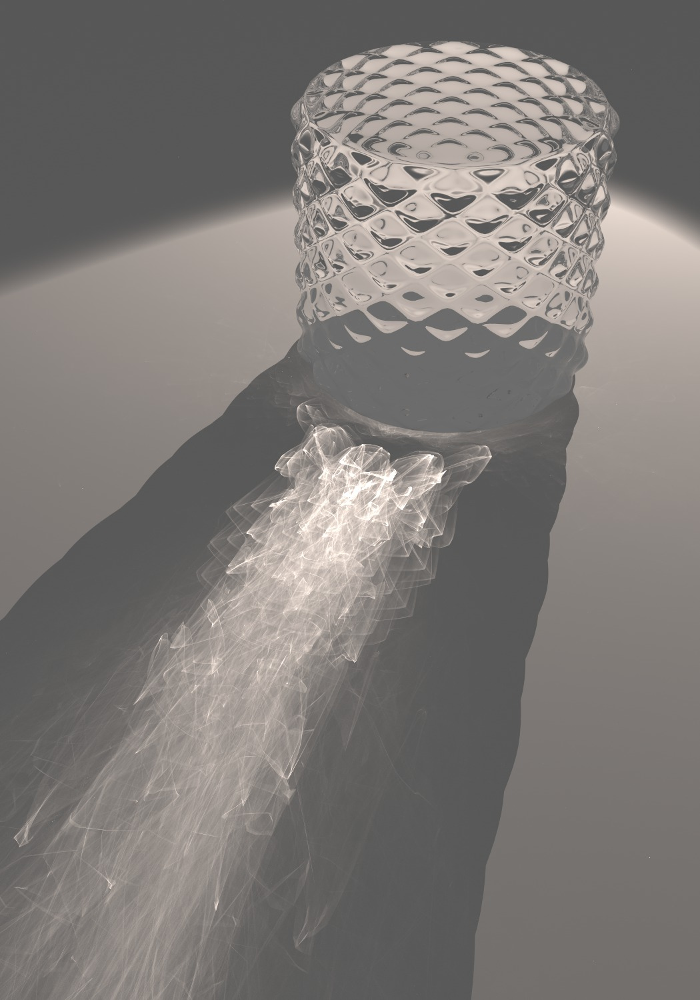

 

pbrt Gallery 
© Matt Pharr, Wenzel Jakob, and Greg Humphreys

# 物理
先是几何，然后是信号，最后是物理。如果你没有阅读过前两篇讲义或者对图形学完全不了解的话，你可能会觉得这计算机图形学讲座越来越离谱了——我就不再强调我在信号部分的开篇强调过的内容了。图形正统在哪不用我多说了吧（笑）。本章节原本的设计是讲完整个渲染技术体系，可惜写完电磁场理论部分字数就已经接近信号部分了，所以无可奈何只能做精简。不过我觉得，我想要传达的信息，在这些内容中应该能传达清楚……吧。

## 主要内容
* 电磁场理论基础
	* 引子：光线追踪在“追”什么？
	* 现代电磁学基本方程
	* 电磁波在无（且远离）源的各向同性均匀无损耗自由空间中的传播
	* 坡印廷（Poynting）矢量
	* 辐射度量学
* 材质
	* 电磁波的反射与折射
	* 双向反射分布函数（Bidirectional Reflectance Distribution Function, BRDF）
* 渲染方程
	* BRDF 渲染方程
	* 路径追踪（Path Tracing）

## 电磁场理论基础
### 引子：光线追踪在“追”什么？
你或许会觉得这只是一个脑筋急转弯：光线追踪追的当然是光！那我要问了，追的是光子吗？还是光波？还是传播常数$\boldsymbol{k}$？还是电场或者磁场？还是坡印廷矢量$\boldsymbol{S}$？……

没有弄懂这个问题，就不算是真正的弄懂光线追踪。事实上，尽管本科计算机图形学课程的大作业多数是写一个路径追踪渲染器，但大家毕竟都有互联网上的代码可以抄，所以也没人真正关心自己有没有弄懂。不仅仅是光线追踪，**电磁学理论是整个基于物理的渲染（Physically Based Rendering，PBR）的理论基础**。在最近的 SIGGRAPH 中，甚至出现了更加逆天的计算力学的融合。遗憾的是，计算机类的同学物理都不太好，要弄懂这些概念对他们来说太困难了（no offense but telling the truth）。不过今天情况有点特殊，因为听讲座的是电子系的同学。从接下来开始，我要干一件历史上几乎**前无古人**的事情：在图形学讲座上讲现代电磁学！

事实上，如果你是高年级的学生或者研究生，你会发现下面的内容，尤其是辐射度量学的内容，似乎和你在电子系上过的一些课程有点相似：**微波、天线、物理光学**……

### 现代电磁学基本方程
**Maxwell 方程组** 实际上是一系列在 Maxwell 时代已知的各个电磁学定律的缝合方程组，这些方程恰好可以描述所有的电磁现象。下面是 Maxwell 方程组的微分形式：
$$
\nabla \cdot \boldsymbol{D}=\rho（高斯定律）\\
\nabla \cdot \boldsymbol{B} = 0（磁感线闭合）\\
\nabla \times \boldsymbol{E} = -\frac{\partial \boldsymbol{B}}{\partial t}（电磁感应）\\
\nabla \times \boldsymbol{H} = \boldsymbol{J} + \frac{\partial \boldsymbol{D}}{\partial t}（自由电流磁效应，位移电流产生磁场）
$$

Maxwell 方程组往往和**电流连续性方程**写在一块：
$$
\nabla \cdot \boldsymbol{J} = -\frac{\partial \rho}{\partial t}
$$

在电磁学中，**物质方程**将几个电磁场量联系在了一起：
$$
\boldsymbol{D} = \varepsilon\boldsymbol{E} （介电常数）\\
\boldsymbol{B} = \mu\boldsymbol{H}（磁导率）\\
\boldsymbol{J} = \sigma\boldsymbol{E}（欧姆定律）
$$

上述的$\varepsilon$ $\mu$ $\sigma$ 也可以是 $3\times3$的矩阵，但是在本讲座中，我们只讨论各向同性的物质，也就是说这三个量都是**标量**。

电磁场在不同介质的界面附近具备边值关系（boundary conditions）：
$$
\boldsymbol{n}\cdot(\boldsymbol{B}_1-\boldsymbol{B}_2)=0（法向磁感应强度连续）\\
\boldsymbol{n}\cdot(\boldsymbol{D}_1-\boldsymbol{D}_2)=0（法向电位移连续）\\
\boldsymbol{n}\times(\boldsymbol{E}_1-\boldsymbol{E}_2)=0（切向电场强度连续）\\
\boldsymbol{n}\times(\boldsymbol{H}_1-\boldsymbol{H}_2)=0（切向磁场强度连续）
$$

到这里，渲染部分就相当于**结束**了。大家可以离场了。因为渲染所要解决的就是电磁波（光）在上述方程的约束下在自由空间中的传播问题。

开玩笑的。老实点，推波动方程了！

### 电磁波在无（且远离）源的各向同性均匀无损耗自由空间中的传播
这个小标题 buff 还挺多的，不过它描述的空间在图形学中其实非常的常见，因为光的波长实在是太小了，我们周围几乎所有的“空”的区域都可以看作是无（且远离）源的各向同性均匀无损耗自由空间。
所以 Maxwell 方程组变为
$$
\nabla \cdot \boldsymbol{E} = 0\\
\nabla \cdot \boldsymbol{B} = 0\\
\nabla \times \boldsymbol{E} = -\frac{\partial \boldsymbol{B}}{\partial t}\\
\nabla \times \boldsymbol{B} = \varepsilon \mu \frac{\partial \boldsymbol{E}}{\partial t}
$$

第 3 式两边取旋度，并且代入第 4 式：
$$
\nabla \times (\nabla \times \boldsymbol{E}) = - \frac{\partial}{\partial t}\left(\nabla \times \boldsymbol{B}\right) = -\varepsilon\mu \frac{\partial^2 \boldsymbol{E}}{\partial t^2}
$$

进一步化为
$$
(\nabla ^2 - \varepsilon\mu\frac{\partial^2}{\partial t^2})\boldsymbol{E} = 0
$$

同理
$$
(\nabla ^2 - \varepsilon\mu\frac{\partial^2}{\partial t^2})\boldsymbol{B} = 0
$$

如果你对数理方程比较熟悉，那么一眼就能看出这是两个同构的**波动方程**。
波动方程并没有多少解析解，下面我们考虑波动方程最简单的解析解：平面波解。
假设电磁波沿着 z 方向传播，那么 $\boldsymbol{E}$ 和 $\boldsymbol{B}$ 仅和 z、t 有关，而与 x、y无关。由此上面两个方程可以化为：

$$
(\frac{\partial^2}{\partial z^2} - \varepsilon\mu\frac{\partial^2}{\partial t^2})\boldsymbol{E} = 0\\
(\frac{\partial^2}{\partial z^2} - \varepsilon\mu\frac{\partial^2}{\partial t^2})\boldsymbol{B} = 0
$$

解得（d' Alembert）:

$$
\boldsymbol{E} = \boldsymbol{f}_1(z-\frac{1}{\sqrt{\varepsilon \mu}}t)+\boldsymbol{f}_2(z+\frac{1}{\sqrt{\varepsilon \mu}}t)
$$

先别急着求解 $\boldsymbol{B}$，观察 $\boldsymbol{E}$ 的通解，我们发现这个式子描述了向 +z 和 -z 两个方向同时传播的平面波，并且平面波的速度（真空下）是：

$$
\frac{1}{\sqrt{\varepsilon \mu}} = \frac{1}{8.8542\times10^{-12}\times4\pi\times 10^{-7}}m/s = 2.99794\times10^8m/s = c
$$

是**光速**。

导出光速的这一节电磁场课程是我在大学上过的最刺激的一节课（笑）。

我们并不总是需要通解中沿两个方向传播的表达，只取一个也是满足 PDE 的。最终我们得到：
$$
\boldsymbol{E}=\boldsymbol{f_E}(z-vt)\\
\boldsymbol{B}=\boldsymbol{f_B}(z-vt)
$$

傅里叶分析告诉我们，**无穷限上平方可积的函数存在傅里叶变换**。无穷限上平方可积在物理上的理解是**能量有限**，E 和 B 显然是能量有限的，所以我们只需研究 E 和 B 在**单个简谐频率下的性质**即可：

$$
\boldsymbol{E} = \boldsymbol{A}cos\left[\frac{2\pi}{\lambda}(z-vt)\right]\\ 
\boldsymbol{B} = \boldsymbol{A'}cos\left[\frac{2\pi}{\lambda}(z-vt)\right]
$$

这里直接给出上式的若干性质：
* 电磁波是横波。也就是说 $\boldsymbol{E}$ 和 $\boldsymbol{B}$ 垂直于 z。
* 电磁垂直。也就是说 $\boldsymbol{E} \cdot \boldsymbol{B} = 0$
* 电磁同相。也就是说
$$
\frac{|\boldsymbol{E}|}{|\boldsymbol{B}|}=\frac{1}{\sqrt{\mu\varepsilon}}=v
$$
> 这一个式子在**光学**课本中比较常用。对于学过**微波**或者**高速电路设计**的同学，由于需要重点研究阻抗及其匹配相关的问题，可能常用的可能并不是这个比例，而是
> $$
\frac{|\boldsymbol{E}|}{|\boldsymbol{H}|}=\sqrt{\frac{\mu}{\varepsilon}}=波阻抗Z_c，单位是\Omega
> $$
>
> 不过它们在各向同性均匀介质中描述的都是同样的物理性质。
>
> 事实上采用波阻抗更能够理解在有损介质中电磁失去同步的现象：**复数波阻抗**。引入复数速度可能看起来有点奇怪。

与此同时，我们定义传播常数 $\boldsymbol{k}$，它的方向和电磁波的传播方向一致，大小是 $\frac{\omega}{v}$，单位是 $rad/m$。由此，上面的简谐电磁波方程也可以写作：

$$
\boldsymbol{E} = \boldsymbol{A}cos(kz-\omega t)\\ 
\boldsymbol{B} = \boldsymbol{A'}cos(kz-\omega t)
$$

你可以认为 $\boldsymbol{k}$ 反映了单位距离对相位的改变情况，与此同时它还表明了平面波的传播方向。

### 坡印廷（Poynting）矢量
从坡印廷矢量开始，电磁学正式和图形学建立起联系。

均匀平面波的坡印廷矢量：
$$
\boldsymbol{S} = \frac{1}{\mu}\boldsymbol{E}\times\boldsymbol{B}
$$

不难发现，坡印廷矢量的方向和电磁波传播的方向是相同的。所以这里有个谐音梗：
> It's a huge coincidence that the Poynting vector is "pointing" in the direction of energy flow.
> \- Microwaves 101

坡印廷矢量是**瞬时能流密度（instantaneous energy flux density）**，你可能会在各种奇怪的书籍和资料上看到它还有各种奇怪的名称，比如辐射强度矢量（来自梁铨廷的《物理光学》，这个名字确实有一定道理，但是非常容易导致混淆）或者瞬时光强（同前一个）或者表面功率密度（surface power density，这个还有点道理）甚至空间功率密度（spatial power density，这个……也有道理吧）。但是在我们的讲义中，请严格地记住，坡印廷矢量就是瞬时能流密度 $\boldsymbol{S}$。

上面写的坡印廷矢量是**瞬时**的能流密度。我们知道光波长的数量级是1e-7，光速的数量级是1e8，那么光波频率的数量级是1e15（SI）。人眼是不可能感受到这么快的频率变化的。所以我们认为人眼和常规摄影感光设备感知到的都是 $\boldsymbol{S}$ 的**平均值**。

在光学和无线电学中，我们使用 $\langle\cdot\rangle$ 表示平均值。

$$
\langle|\boldsymbol{S}|\rangle=\frac{1}{T}\int_{0}^{T}|\boldsymbol{S}|dt = \frac{1}{2}v\varepsilon \boldsymbol{A}^2
$$

事实上，在实际应用时，我们往往只关心一个相对的值。所以可以这样理解：

$$
\langle|\boldsymbol{S}|\rangle\propto\boldsymbol{A}^2
$$

一些书籍将 $\langle|\boldsymbol{S}|\rangle$ 称为光强，虽然并非没有道理（单位球面上的径向坡印廷矢量大小就是光强），但是这依然容易导致混淆，在稍后，我们会给出光强的严格定义。所以在本讲义中，请严格地记住，上面的式子描述的就叫**平均能流密度（average energy flux density）**。

### 辐射度量学

现在开始进入名词地狱环节！

我们已经定义了**瞬时能流密度$\boldsymbol{S}$** 及其平均值**平均能流密度$\langle\boldsymbol{|S|}\rangle$**。这两个物理量的单位都是 $W/m^2$。

定义**辐射通量（radiant flux）$\Phi_e$**：

> 请注意，截至 2023/7/23。Wikipedia 这一个页面的瞬时表达公式有错。🤣👉
> 
> 其实在工程和科学领域，**Wikipedia 的准确度是很差的**，堪比电子系的课本。可能对清华学生唯一的作用是帮助大家键政（笑）

我们只关心平均辐射通量：

$$
\Phi_e=\int_{\Sigma}\langle|\boldsymbol{S}|\rangle cos\alpha dA\\
\alpha 是小面元法向量和 \boldsymbol{S} 方向的夹角。
$$

辐射通量是**一块实体表面积**在**发射、反射、传输和接收**的**功率**。类比上面的理解，**平行于表面积面元的能流密度与面元无关。** 辐射通量的单位是 $W$。

现在，我们**考虑一个三维空间中的闭合曲面，我们先假定它是一个光源**。很显然的，这个光源上的每一个小面元产生的辐射的方向都是垂直于面元的（学过天线的同学，可以认为观察点处在**远场区**，这是显然的，因为光的波长实在是太小了）。正如之前我们定义的，这个光源的辐射通量是 $\Phi_e$。

现在，我们从一定远处看这个不一定规则的闭合曲面。很显然的，这个曲面正在不停的向外释放能量。如何去统计这个曲面释放的全部能量呢？不难想到我们只需要用一个闭合的探测曲面把光源包起来就行了。这个闭合的探测曲面未必要是均匀的，在球坐标系下，我们能写出下列积分表达式：

$$
\Phi_e = \oint_{探测球面P}\langle|\boldsymbol{S}|\rangle\cdot d\boldsymbol{P}=\oint_{探测球面P}\langle|\boldsymbol{S}|\rangle\cdot\hat{\boldsymbol{n}}r^2sin\theta d\phi d\theta
$$

为了节省我打 LaTeX 公式的时间，从现在以后，$\boldsymbol{S}$就表示平均坡印廷矢量，而$S$表示其标量大小，右下角角标表示其某个方向的分量。

$$
\Phi_e = \oint_{探测球面P}S_rr^2sin\theta d\phi d\theta
$$

引入立体角注记 $sin\theta d\phi d\theta = d\Omega$：

$$
\Phi_e = \oint_{探测球面P}S_rr^2 d\Omega
$$

现在我们定义**光照强度（light intensity，简称光强）** 或者 **辐射强度（radiant intensity）**

$$
I = S_rr^2
$$

从而

$$
\Phi_e = \oint_{探测球面P}I d\Omega
$$

或者它的微分形式

$$
I = \frac{\partial \Phi_e}{\partial \Omega}
$$

在日常使用中，我们认为 $I$ 是沿着立体角 $\Omega$ 方向（其实就是径向）的一个量，所以**也记作 $I_\Omega$**。它的单位是 $W/sr$，$sr$是立体角，和弧度相似，它也是无量纲的，所以也可以记作 $W$。

好了，现在我们已经知道一整块闭曲面光源对外**任何一个方向上的光强**了。那么对于某一个方向上的光强，曲面上的各个部分对它的**贡献**有多少呢？

所以我们定义 **辐亮度（radiance，简称亮度）**：

$$
L_{\Omega} = \frac{\partial I_{\Omega}}{\partial(A cos\theta)} = \frac{\partial^2\Phi_e}{\partial\Omega\partial(Acos\theta)}\\
其中\theta是I_\Omega所指的\Omega方向和表面微元\partial A的夹角。注意这里的\theta和上面曲面积分的\theta是无关的。
$$

**辐亮度是光源曲面上单位面元在 $\Omega$ 方向产生的光强贡献。** 单位是$W\cdot sr^{-1} \cdot m^{-2}$。

请注意，上述计算过程采用的假定是发光曲面，但是其实这个曲面也可以不是发光曲面。我们可以进行一个非常自然的推广：反射过程也可以看作是发射过程，例如月球在夜晚通过反射光照亮大地。假如有一个物种只在夜晚出现，他们不知道太阳的存在，那么他们的早期科学中，或许会认为月球是一个自发光的光源。

对于接受外部光源的面元，还有一个比较重要的物理量**辐照度（irradiance）**：

$$
E_{in}(\boldsymbol{x}, \omega_i) = \int_\Omega L_{in}(\boldsymbol{x}, \omega_i) cos\theta_i d\omega_i
$$

**单位面积的辐照度（接收到的总亮度）** 等于**法向接受的亮度对于球面角的积分**。可以理解为一种反向的亮度。

在路径追踪算法中，和最终像素点颜色有关的其实就是光线投射命中点的辐亮度。

## 材质

### 电磁波的反射与折射
电磁波在两个不同介质的界面上，会发生反射与折射。假设入射波$\boldsymbol{k}_1$，反射波$\boldsymbol{k}_1'$，透射波$\boldsymbol{k}_2$。在初中我们就学过**反射定律**：入射角$\theta_1$等于反射角$\theta_1'$；和**折射定律（斯涅尔定律，Snell's law）**：
$$
\frac{sin\theta_1}{v_1}=\frac{sin\theta_2}{v_2}
$$

或者
$$
n_1sin\theta_1=n_2sin\theta_2
$$

在现代电磁学理论中，你可以使用**界面上相速度相等**来得到上述结论。但这不重要。可能你已经感受到，**“能量”对我们来说才是最关键的**，现在我们来讨论以下电磁波反射和折射过程中的能量变化情况。

回忆一下刚才我们推导得到的平面波，在平面电磁波中，**电场方向**垂直于磁场方向，并不断沿着传播常数的方向前进。这其实隐含了一个结论，即电磁波本身的振动也是有方向的，这一方向被称为**极化方向**。我们使用**电场的振动方向**来表征电磁波的极化方向。

在电磁波入射某一界面时（除了特殊的垂直入射以外），除了“界面”其实还隐含了一个平面——**“入射平面”**。这个平面是入射传播常数和入射点法线形成的平面。我们**把极化方向垂直于入射面的波称为 S 波；把极化方向平行于入射面的波称为 P 波**。

让我把写在本讲义开头的边值条件搬下来，待会好用：
$$
\boldsymbol{n}\cdot(\boldsymbol{B}_1-\boldsymbol{B}_2)=0（法向磁感应强度连续）\\
\boldsymbol{n}\cdot(\boldsymbol{D}_1-\boldsymbol{D}_2)=0（法向电位移连续）\\
\boldsymbol{n}\times(\boldsymbol{E}_1-\boldsymbol{E}_2)=0（切向电场强度连续）\\
\boldsymbol{n}\times(\boldsymbol{H}_1-\boldsymbol{H}_2)=0（切向磁场强度连续）
$$

**S波**

在本讲义中，和大多数物理课本一样，未加粗的相同字母表示矢量大小。

$$
E_{1s}+E_{1s}'=E_{2s}（切向电场强度连续）\\
H_{1p}cos\theta_1-H_{1p}'cos\theta_1=H_{2p}cos\theta_2（切向磁场强度连续）
$$

别忘了之前我们提到的，平面电磁波的 $\boldsymbol{H}$ 和 $\boldsymbol{E}$ 是有联系的。另外$\theta_1$和$\theta_2$可以使用斯涅尔定律联系起来。

解上述方程得到：
$$
反射波和入射波的振幅比r_s=\frac{A_{1s}'}{A_{1s}}=-\frac{sin(\theta_1-\theta_2)}{sin(\theta_1+\theta_2)}\\
透射波/折射波和入射波的振幅比t_s=\frac{A_{2s}}{A_{1s}}=\frac{2sin\theta_2cos\theta_1}{sin(\theta_1+\theta_2)}
$$

**P波**

$$
E_{1p}cos\theta_1-E_{1p}'cos\theta_1=E_{2p}cos\theta_2（切向电场强度连续）\\
H_{1s}+H_{1s}'=H_{2s}（切向磁场强度连续）
$$

同理得到

$$
反射波和入射波的振幅比r_p=\frac{A_{1p}'}{A_{1p}}=\frac{tan(\theta_1-\theta_2)}{tan(\theta_1+\theta_2)}\\
透射波/折射波和入射波的振幅比t_p=\frac{A_{2p}}{A_{1p}}=\frac{2sin\theta_2cos\theta_1}{sin(\theta_1+\theta_2)cos(\theta_1-\theta_2)}
$$

现在我们考虑入射波、反射波和折射波的功率。定义功率反射系数/反射率 $R$ 和功率传输系数/透射率 $T$ 分别为：
$$
R = \frac{\hat{\boldsymbol{n}}\cdot\boldsymbol{S}_r}{\hat{\boldsymbol{n}}\cdot\boldsymbol{S}_i}\\
T = \frac{\hat{\boldsymbol{n}}\cdot\boldsymbol{S}_t}{\hat{\boldsymbol{n}}\cdot\boldsymbol{S}_i}
$$

> 在微波与天线理论中常用“功率反射系数”和“功率传输系数”；在光学中常用“反射率”和“透射率”。

自然光是朝向各个方向振动的光。我们可以将自然光理解为能量相等的S波和P波的叠加。在之前的讲义的线性时不变系统的部分里我们提到过，大部分的物理现象都满足叠加原理，对能量更是如此，所以考虑自然光在界面上的能量传输，只需要把S波和P波的能量传输比例叠加起来就可以了。最后我们得到：
$$
R_n=\frac{1}{2}\left[ \frac{sin^2(\theta_1-\theta_2)}{sin^2(\theta_1+\theta_2)} + \frac{tan^2(\theta_1-\theta_2)}{tan^2(\theta_1+\theta_2)} \right]
$$

在大部分光学课本上，你只能看到上面这个自然光反射能量传输的式子，而看不到透射能量的式子。原因很简单，根据能量守恒：
$$
R_n+T_n = 1
$$

对于自然光反射率表达式，我们发现，反射率随着入射角的增大而增大，并且入射角越大，反射率的增长速度越快。当入射角几乎是掠射时，反射率飙升到接近1。这就是**菲涅尔现象（Fresnel Effect）**。

由于反射率表达式过于复杂，涉及到三角函数，不便于计算。在计算机中，我们使用另一种方法模拟菲涅尔现象。这种模拟方式称为 **Schlick 近似**。在大部分的 PBR 渲染器代码中，你都能找到 Schlick 这个名字。

[Cycles 渲染器演示菲涅尔现象]

### 双向反射分布函数（Bidirectional Reflectance Distribution Function, BRDF）

到目前为止，我们已经推导出了自然光在界面处的反射与透射行为。但是不难发现，直到现在我们对物质的建模依然有一个本质的缺陷：我们的模型中，光从入射角射入后，只会遵循理想镜面的反射定律从反射角射出。或者说，我们只给理想镜面建了模型。然而真实世界的物体似乎并不都是镜面，光射到物体表面以后，有可能向各个方向发生散射。所以问题出在哪？

首先需要明确的一点是，光的反射定律是不容违背的铁律，一旦发生反射，不可能会出现反射角与入射角不同的情况。经过简单的思考，你可能能反应过来：表面是粗糙的，或者说存在大量的**微表面（microfacet）**。在这些微表面上，光反射时的法线未必与宏观的法线平行，由此，取决于表面的粗糙程度（roughness），光有可能朝各个方向散射。

由此，BRDF 函数被提出。BRDF 函数可以被记为：
$$
f_r(\boldsymbol{x}, \omega_i, \omega_o)
$$

其中 $\boldsymbol{x}$ 是表面坐标； $\omega_i$ 是入射立体角； $\omega_o$ 是出射立体角。不难发现这个模型似乎没有考虑透射的问题，对于透射有另一套称为**双向散射分布函数（Bidirectional Scattering Distribution Function, BSDF）** 的模型，这里不再详细介绍。

BRDF 是从能量角度对光的反射进行的一个**抽象**。我们不难想象，如果我们尝试去暴力模拟微表面上按一定规律分布的随机法线下光的反射，所需要的计算开销是极大的。所以我们不去考虑微表面具体是什么样的，转而将微表面变为一个抽象，而去研究能否从更高的层次理解这个问题，并提供微表面的近似。

从能量角度，我们已经知道**某一面元的辐照度（接收到的平均能流密度）** 等于**法向接受的亮度对于球面角的积分**：
$$
E_{in}(\boldsymbol{x}, \omega_i) = \int_\Omega L_{in}(\boldsymbol{x}, \omega_i) cos\theta_i d\omega_i
$$

与此同时，这个面元沿着 $\omega_r$ 的方向向外辐射的辐亮度可以表示为 $L_r(\boldsymbol{x}, \omega_r)$。

从物理上不难想到，如果我们增强入射光的亮度而不改变其方向，在固定方向的观测点观测到的反射光的亮度和入射光亮度的增强应该是成正比的，也就是：
$$
L_r(\boldsymbol{x}, \omega_r) \propto E_{in}(\boldsymbol{x}, \omega_i)
$$

比例系数在多数情况下应该是 $\omega_i$ 和 $\omega_r$ 的函数。这个比例系数就被定义为 BRDF。

$$
f_r(\boldsymbol{x}, \omega_i, \omega_r) = \frac{d L_r(\boldsymbol{x}, \omega_r)}{d E_{in}(\boldsymbol{x}, \omega_i)}
$$

如果把 $E_{in}$ 的关系式也代入 BRDF 定义式，可以得到
$$
f_r(\boldsymbol{x}, \omega_i, \omega_r) = \frac{d L_r(\boldsymbol{x}, \omega_r)}{L_{in}(\boldsymbol{x}, \omega_i) cos\theta_i d\omega_i}
$$

这是 BRDF 的另一个常用表达式。

一个非常常见的 BRDF 是 **Lambertian 表面**：
Lambertian表面是理想散射表面，也就是说Lambertian表面上从各个方向看过去的亮度是一样大的，并且这个亮度和入射光亮度的法线分量成正比。
也就是说
$$
f_{r,Lambertian}(\boldsymbol{x}, \omega_i, \omega_r) = f_r(\boldsymbol{x}, \omega_i) = \frac{k \cdot L_{in}(\boldsymbol{x}, \omega_i) cos\theta_i d\omega_i}{L_{in}(\boldsymbol{x}, \omega_i) cos\theta_i d\omega_i} = k\\
k 是常数。
$$

再考虑一个例子，**理想镜面**：
对于理想镜面，反射亮度和入射亮度对称。也就是：
$$
L_r(\boldsymbol{x}, \omega_r) = \int_\Omega L_{in}(\boldsymbol{x}, \omega_i) \delta(\omega_r-\omega_r) d\omega_i = L_{in}(\boldsymbol{x}, \omega_r)\\
f_{r,Mirror}(\boldsymbol{x}, \omega_i, \omega_r) = \frac{L_{in}(\boldsymbol{x}, \omega_i)\delta(\omega_i-\omega_r)d\omega_i}{L_{in}(\boldsymbol{x}, \omega_i) cos\theta_i d\omega_i} = \frac{\delta(\omega_i-\omega_r)}{cos\theta_i}\\
$$

## 渲染方程

### BRDF 渲染方程

现在我们考虑一个新的例子。有一块实体曲面，在曲面的一侧的空中放一只眼睛（好像有点恐怖，但是形象/笑），这只眼睛沿着某个方向朝着曲面上的某一点看。那么实际上这只眼睛就是在测量它看着的这个点的辐亮度。所以，要知道我们的眼睛对这个点的测量结果是怎样的，我们**只需要确定这一点处的辐亮度 $L_r$** 就可以了。

是不是有点熟悉？在刚才的 BRDF 函数的推导中，我们曾经得到
$$
f_r(\boldsymbol{x}, \omega_i, \omega_r) = \frac{d L_r(\boldsymbol{x}, \omega_r)}{L_{in}(\boldsymbol{x}, \omega_i) cos\theta_i d\omega_i}
$$

稍作变形，就可以得到
$$
L_r(\boldsymbol{x}, \omega_r)= \int_\Omega \bigg[L_{in}(\boldsymbol{x}, \omega_i) cos\theta_i\bigg] f_r(\boldsymbol{x}, \omega_i, \omega_r) d\omega_i
$$

这实际上就是只有反射项的渲染方程！

如果我们再考虑一个发射项，那么就可以得到 BRDF 下渲染方程比较完全的形式：
$$
L_o(\boldsymbol{x}, \omega_r)= L_e(\boldsymbol{x}, \omega_r) + \int_\Omega \bigg[L_{in}(\boldsymbol{x}, \omega_i) cos\theta_i\bigg] f_r(\boldsymbol{x}, \omega_i, \omega_r) d\omega_i
$$

事实上，渲染方程的意义并不仅仅在于确定“眼睛”所观察的一点的辐亮度。渲染方程是递归式的，这意味着它可以用于路径追踪。

### 路径追踪（Path Tracing）

路径追踪源于光线投射。在“几何”部分中，我们曾经了解过光线投射的基本原理：从摄像机焦点向屏幕上每个像素点发射光线，如果光线和场景中的物体相交，那么通过光线和物体相交的信息对屏幕上这个像素点着色。

路径追踪其实处理的就是着色的过程。在第一次光线求交迭代中，摄像机就是我们刚才推导渲染方程时所说的“眼睛”，要计算屏幕上像素点的颜色，在**色调映射（Tone mapping）** 之前首先就要确定屏幕上这个点的辐亮度。这意味着我们需要使用渲染方程。我们不妨假设在第一次光线求交迭代中，与初始光线相交的物体并不是光源，那么此时只需要采用渲染方程的反射项即可：
$$
L_r(\boldsymbol{x}, \omega_r)= \int_\Omega \bigg[L_{in}(\boldsymbol{x}, \omega_i) cos\theta_i\bigg] f_r(\boldsymbol{x}, \omega_i, \omega_r) d\omega_i
$$

了解一下局势：我们知道BRDF函数，但是不知道交点 $\boldsymbol{x}$ 处所有 $L_{in}$ 的情况，因此我们无法进行积分。

为了解决这个问题，在路径追踪算法中，我们在交点处继续生成一个新的光线（以下称为光线2）。生成光线2的过程遵循某种分布，例如，对于 Lambertian 表面，光线2在**均匀半球（uniform hemisphere）** 中等概率生成。在本讲座中我们没有时间介绍更多生成光线2的方法了。光线2生成以后，渲染方程的递归特征就能为我们所用了。因为积分计算实际上涉及到光线2的光强，所以我们现在可以认为光线2的起点（初始光线和物体的交点）就是一个**新的“眼睛”**，我们只需要对光线2继续执行上述递归过程即可，直到递归达到某种条件而终止。最简单的终止递归的方法就是深度限制，因为我们之后要进行**多次采样**。

你可能已经注意到，路径追踪算法对某个像素的递归全过程中，**从头到尾追踪的光线只有一条**。这是因为我们使用**蒙特卡洛（Monte Carlo）** 方法计算积分。与在采样点同时射出多条光线不同，我们对同一点进行多次采样，最后取平均值。

路径追踪算法是实现**全局光照（global illumination）** 比较简单的方法。有一些加速手段，比如基于有限元的 Radiosity 方法、辐照缓存（Radiosity Caching）和光子映射（Photon mapping）方法等。

